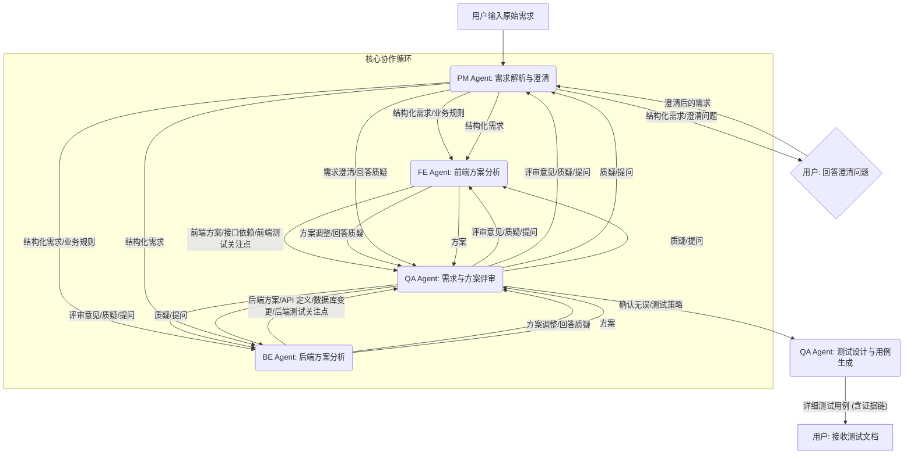

# AI 测试工程师系统：实现级产品需求文档 (PRD)

## 1. 引言

本产品需求文档 (PRD) 旨在为“多智能体协作 AI 测试工程师系统”的开发提供详细的、实现级别的规范。该系统通过模拟真实研发团队的协作模式，引入产品经理 (PM)、前端开发 (FE)、后端开发 (BE) 和测试工程师 (QA) 四个 AI 智能体角色，结合本地部署的 Claude 大模型和本地代码库，实现对项目需求的深度理解、技术方案的全面分析、以及基于证据的测试设计与用例生成。此外，系统将集成“自动化系统探索与功能映射”模块，以自动发现并构建目标系统的功能全景图。

本 PRD 的目标是提供足够清晰和结构化的信息，使得 AI 能够：
1.  **理解系统架构与模块职责**：明确各 Agent 的功能边界和协作方式。
2.  **实现核心功能**：根据详细的功能描述和技术规范进行编码。
3.  **遵循交互协议**：确保各模块之间以及与本地环境（Claude、代码库）的正确通信。
4.  **构建持久化机制**：正确存储和管理项目记忆、知识库和代码分析结果。
5.  **产出可验证的成果**：生成带有明确证据链的测试用例和功能全景图。

## 2. 系统概述与核心价值

**系统名称**：多智能体协作 AI 测试工程师系统

**核心价值**：
*   **项目认知与长期记忆**：通过多源信息（代码、文档、用户交互）构建“项目大脑”，并实现知识的长期沉淀，避免重复学习。
*   **基于证据的推理**：强制要求所有决策和产出（尤其是测试用例）必须有明确的证据链支持，杜绝“幻觉”和随意猜测。
*   **智能提问与澄清**：在信息不完整或存在歧义时，系统能够主动、精准地向用户提问，将不确定性转化为待确认问题。
*   **影响分析能力**：能够识别需求变更对系统各模块、功能和代码的影响范围。
*   **自动化功能发现**：通过模拟用户行为，自动探索并构建目标系统的功能全景图。
*   **高效协作与质量保障**：通过多智能体协作，模拟真实研发流程，提升需求理解深度和测试覆盖全面性，最终保障软件质量。

## 3. 核心模块与角色定义

系统由以下核心模块和 AI 智能体角色组成，它们共同协作完成任务。每个 Agent 都将由一个独立的 AI 智能体扮演，并被赋予特定的职责、知识范围和交互模式。

### 3.1 产品经理 (PM) Agent

*   **核心职责**：
    *   **需求理解与澄清**：接收用户输入的原始需求，进行初步的语义解析和意图识别，将其转化为结构化的产品需求描述。
    *   **业务规则定义**：从需求中提取并定义核心业务规则、用户故事和验收标准。
    *   **用户场景分析**：分析不同用户角色和使用场景，识别潜在的边缘情况和异常流程。
    *   **需求优先级评估**：根据业务价值和技术可行性，对需求进行初步的优先级排序。
    *   **与用户交互**：当需求不明确或存在歧义时，主动向用户提问以获取澄清。
*   **知识范围**：产品需求文档 (PRD)、用户故事、业务流程图、市场分析报告、用户反馈。
*   **交互模式**：主要与用户、FE Agent 和 BE Agent 交互，提供需求输入和澄清，接收技术可行性反馈。
*   **输出**：结构化的产品需求文档（包含用户故事、业务规则、验收标准）、澄清问题列表。

### 3.2 前端开发 (FE) Agent

*   **核心职责**：
    *   **UI/UX 交互分析**：根据 PM Agent 提供的需求，分析前端界面交互逻辑、用户体验流程和数据展示方式。
    *   **前端技术实现评估**：评估需求在前端技术栈（如 React, Vue, Angular）下的实现可行性、复杂度和潜在风险。
    *   **接口依赖识别**：识别前端实现所需依赖的后端 API 接口及其数据结构。
    *   **前端代码分析**：分析现有前端代码库，识别受需求变更影响的组件、页面和交互逻辑。
    *   **与 PM/BE Agent 交互**：向 PM Agent 澄清 UI/UX 细节，向 BE Agent 确认接口定义和数据格式。
*   **知识范围**：前端代码库、UI/UX 设计稿、前端技术规范、API 文档（前端视角）。
*   **交互模式**：主要与 PM Agent、BE Agent 和 QA Agent 交互，提供前端实现方案和风险，接收接口定义和测试反馈。
*   **输出**：前端技术方案概要、受影响的前端组件列表、前端接口依赖列表、前端测试关注点。

### 3.3 后端开发 (BE) Agent

*   **核心职责**：
    *   **业务逻辑实现分析**：根据 PM Agent 提供的需求，分析后端业务逻辑的实现方式、数据流和状态管理。
    *   **API 接口设计**：设计或修改后端 API 接口的请求/响应结构、认证授权机制和错误处理。
    *   **数据模型设计**：评估需求对数据库表结构、缓存策略和数据存储的影响。
    *   **后端代码分析**：分析现有后端代码库，识别受需求变更影响的服务、模块、数据库操作和第三方集成。
    *   **与 PM/FE Agent 交互**：向 PM Agent 澄清业务逻辑细节，向 FE Agent 提供接口定义，接收前端调用反馈。
*   **知识范围**：后端代码库、数据库设计文档、API 文档（后端视角）、系统架构文档、第三方服务集成文档。
*   **交互模式**：主要与 PM Agent、FE Agent 和 QA Agent 交互，提供后端实现方案和风险，接收前端接口调用反馈和测试反馈。
*   **输出**：后端技术方案概要、API 接口定义 (Swagger/OpenAPI)、受影响的后端服务/模块列表、数据库变更方案、后端测试关注点。

### 3.4 测试工程师 (QA) Agent

*   **核心职责**：
    *   **需求评审与质疑**：从测试视角评审 PM Agent 提供的需求，识别潜在的模糊点、遗漏点和不一致性，并向 PM Agent 提出质疑。
    *   **测试策略制定**：根据需求和 FE/BE Agent 提供的技术方案，制定全面的测试策略，包括功能测试、性能测试、安全测试、兼容性测试、回归测试等。
    *   **测试设计与用例生成**：基于 PM Agent 的验收标准和 FE/BE Agent 的实现细节，设计详细的测试用例，并确保每条用例都有明确的证据链。
    *   **影响分析验证**：验证 FE/BE Agent 提出的影响范围，并补充遗漏点。
    *   **与所有 Agent 交互**：作为质量守门员，与所有 Agent 紧密协作，确保需求理解一致，技术方案合理，并提供全面的测试覆盖。
*   **知识范围**：所有 Agent 的输出（需求文档、技术方案、接口定义）、历史测试用例、缺陷报告、测试规范、行业最佳实践。
*   **交互模式**：与所有 Agent 交互，提出问题、质疑、建议，并最终产出测试设计和用例。
*   **输出**：测试计划、测试设计文档、详细测试用例（包含证据链）、缺陷报告（模拟）。

### 3.5 自动化系统探索与功能映射模块

*   **核心职责**：
    *   **页面遍历与导航**：模拟用户行为，递归探索目标系统的所有可访问页面和状态。
    *   **功能点识别与提取**：从页面元素、网络请求、页面标题、URL 路径等信息中智能识别和提取功能点。
    *   **状态管理与去重**：记录已访问的页面和功能，避免重复探索和死循环。
    *   **功能图谱构建**：将发现的功能点及其之间的关系构建成图谱。
    *   **信息汇总与输出**：生成结构化的功能列表、功能树或功能图谱，并将其存储到知识库和记忆模块。
*   **知识范围**：目标系统的 URL 结构、页面 DOM 结构、网络请求模式、历史探索数据。
*   **交互模式**：主要由 QA Agent 触发和使用，也可独立运行以更新知识库。输出结果供所有 Agent 共享。
*   **输出**：系统功能全景图（功能点列表、功能图谱）、探索日志、API 接口列表。

### 3.6 职责边界与协作目标

*   **职责边界**：每个 Agent 专注于其专业领域，避免越俎代庖。例如，FE Agent 不会直接修改后端代码，QA Agent 不会直接编写业务逻辑。
*   **协作目标**：通过多 Agent 之间的信息共享、交叉验证和相互质询，共同达成对需求的**一致性理解**和对技术方案的**共识**，最终产出高质量、高可信度的测试设计和用例。
*   **消除幻觉**：当一个 Agent 提出一个结论时，其他 Agent 会从各自的专业视角进行审查和质疑。如果存在信息缺失或不一致，QA Agent 将会触发提问机制，向用户寻求澄清，从而将“幻觉”转化为“待确认问题”。


## 4. 自动化系统探索与功能映射模块：实现细节

“自动化系统探索与功能映射”模块旨在通过模拟用户行为，自动遍历目标系统（Web 应用或桌面应用）的所有可访问页面和功能点，并将其结构化地记录下来。其核心目标是构建一个全面的“系统功能全景图”，为后续的测试设计、影响分析和项目认知提供基础数据。该模块将作为 QA Agent 的一个强大工具，也可独立运行以更新系统的知识库。

### 4.1 核心功能与工作流程

#### 4.1.1 核心功能

*   **页面遍历与导航**：模拟用户点击、表单提交、URL 跳转等操作，递归地探索所有可访问的页面和状态。
*   **功能点识别与提取**：从页面元素（按钮、链接、表单）、网络请求（API 调用）、页面标题、URL 路径等信息中智能识别和提取功能点。
*   **状态管理与去重**：记录已访问的页面、已识别的功能，避免重复探索和陷入死循环。
*   **功能图谱构建**：将发现的功能点及其之间的关系（如页面跳转、功能依赖）构建成图谱。
*   **信息汇总与输出**：生成结构化的功能列表、功能树或功能图谱，并将其存储到知识库和记忆模块。

#### 4.1.2 工作流程

```mermaid
graph TD
    A[起始URL/入口点] --> B(页面加载与渲染)
    B --> C{页面分析器}
    C -- 提取可交互元素/URL --> D(待访问队列)
    C -- 识别功能点 --> E(功能点存储)
    C -- 提取API调用 --> F(API接口存储)

    D -- 检查是否已访问/去重 --> G{状态管理器}
    G -- 未访问 --> H(模拟用户操作/导航)
    G -- 已访问 --> I(跳过)

    H --> B

    E --> J(功能图谱构建器)
    F --> J
    J --> K[系统功能全景图 (知识库/记忆)]

    subgraph 探索循环
        B
        C
        D
        G
        H
        I
    end
```

### 4.2 技术实现细节

#### 4.2.1 页面遍历与导航 (Web Crawler / Browser Automation)

*   **技术选型**：
    *   **Web 应用**：使用基于 Chromium 的自动化工具，如 **Puppeteer (Node.js)** 或 **Selenium (Python)**。这些工具能够模拟真实浏览器行为，包括 JavaScript 执行、DOM 渲染、CSS 样式加载，从而处理动态加载的页面。
    *   **桌面应用**：如果目标系统是桌面应用，则需要使用特定的桌面自动化框架，如 **PyAutoGUI (Python)** 或 **WinAppDriver (Windows)**。
*   **核心逻辑**：
    1.  **启动浏览器/应用**：根据配置启动一个无头 (headless) 或有头 (headed) 浏览器实例，或连接到桌面应用进程。
    2.  **导航**：加载起始 URL 或打开应用入口。
    3.  **元素查找**：使用 CSS 选择器、XPath 或其他定位策略查找页面上所有可点击、可输入、可交互的元素（`<a>`, `<button>`, `<input>`, `<form>` 等）。
    4.  **事件触发**：模拟点击事件、输入事件、表单提交事件。对于表单，可以尝试使用默认值或随机生成合法值进行提交。
    5.  **URL 跟踪**：记录每次导航后的当前 URL，并将其加入待访问队列。
    6.  **页面截图**：可选地，为每个发现的页面生成截图，以便人工审查和可视化。

#### 4.2.2 状态管理与去重 (State Manager)

*   **数据结构**：
    *   **`visited_urls` (Set)**：存储已访问过的 URL，用于快速判断是否重复。
    *   **`visited_elements` (Set)**：存储已点击或交互过的页面元素（可通过元素的 XPath 或唯一 ID 标识），避免重复操作。
    *   **`pending_queue` (Queue)**：存储待访问的 URL 或待交互的元素。
*   **持久化**：`visited_urls` 和 `visited_elements` 需要持久化到关系型数据库或文件系统，以便在探索中断后能够恢复。
*   **去重策略**：
    *   **URL 标准化**：对 URL 进行标准化处理（去除查询参数、锚点等），以避免因 URL 细微差异导致的重复访问。
    *   **参数化 URL 处理**：对于带有动态参数的 URL（如 `/product?id=123`），需要识别其模式（`/product?id={id}`），并只记录模式，避免无限探索。
    *   **页面内容哈希**：对于某些 URL 变化但内容不变的页面，可以计算页面内容的哈希值进行去重。

#### 4.2.3 功能点识别与提取 (Function Extractor)

*   **识别策略**：
    1.  **基于 DOM 元素**：
        *   **按钮/链接文本**：提取 `<button>`, `<a>` 标签的文本内容作为功能描述。
        *   **表单提交**：识别 `<form>` 标签的 `action` 属性和提交按钮，结合表单字段，推断功能。
        *   **元素 ID/Class**：利用具有语义的 `id` 或 `class` 属性（如 `login-button`, `submit-order`）识别功能。
    2.  **基于网络请求**：
        *   **API 监控**：拦截浏览器发出的 XHR/Fetch 请求，记录请求 URL、方法、参数和响应。将这些 API 视为功能点。
        *   **语义分析**：对 API URL 路径（如 `/api/user/login`, `/api/order/create`）进行语义分析，提取功能名称。
    3.  **基于页面标题/URL 路径**：
        *   **页面标题**：提取 `<title>` 标签内容作为页面功能概述。
        *   **URL 路径**：分析 URL 路径结构（如 `/admin/users/add`），识别模块和操作。
    4.  **基于 Agent 推理**：结合 LLM 对页面内容和交互的语义理解，推断更抽象的功能点。
*   **结构化输出**：每个识别到的功能点应包含：
    *   `function_id` (UUID)
    *   `name` (功能名称，如“用户登录”、“创建订单”)
    *   `description` (详细描述)
    *   `type` (功能类型：`PAGE_NAV`, `API_CALL`, `FORM_SUBMIT`, `UI_INTERACTION`)
    *   `entry_point` (触发该功能的 URL 或元素 XPath)
    *   `related_apis` (关联的 API 接口列表)
    *   `parameters` (功能参数，如表单字段)
    *   `parent_function_id` (如果存在父子功能关系)
    *   `evidence_chain` (记录功能点来源，如页面截图、DOM 结构、API 请求日志)

#### 4.2.4 功能图谱构建 (Function Graph Builder)

*   **数据模型**：使用图数据库 (如 Neo4j) 存储功能点 (`Function Node`) 和它们之间的关系 (`Relationship`)。
    *   **节点 (Node)**：每个功能点 (`Function Node`) 对应一个节点，包含上述结构化输出的属性。
    *   **边 (Edge)**：表示功能点之间的关系，例如：
        *   `NAVIGATES_TO`：从功能 A 导航到功能 B。
        *   `TRIGGERS`：功能 A 触发了功能 B（如点击按钮触发 API 调用）。
        *   `DEPENDS_ON`：功能 A 的执行依赖于功能 B 的结果。
*   **构建过程**：在探索过程中，每当发现新的功能点或功能点之间的交互时，即更新图谱。

### 4.3 与其他模块的集成

*   **知识库 (Knowledge Base)**：
    *   **存储**：将构建好的“系统功能全景图”（功能点列表、功能图谱）作为新的知识条目存储到知识库中。
    *   **检索**：其他 Agent（特别是 QA Agent）可以查询知识库，获取系统的功能列表和功能依赖关系，用于测试策略制定和影响分析。
*   **记忆模块 (Memory Module)**：
    *   **更新**：将探索过程中发现的、具有普遍性的交互模式、常见表单字段、API 命名规范等作为 `CODE_INSIGHT` 或 `BIZ_LOGIC` 类型的记忆单元存储。
*   **QA Agent**：
    *   **输入**：QA Agent 将利用该模块产出的功能全景图作为其测试设计的基础，确保测试覆盖的全面性。
    *   **影响分析**：结合功能图谱，QA Agent 可以更准确地进行影响分析，识别需求变更可能影响的功能路径。

### 4.4 本地环境交互协议

为了确保该模块能在本地环境中高效运行，并与本地 Claude 和代码库无缝集成，需要定义清晰的交互协议：

*   **命令行接口 (CLI)**：模块应提供一个 CLI 接口，允许系统协调器或其他 Agent 启动探索任务，并传递起始 URL、探索深度、认证信息等参数。
    *   `explore --url <start_url> --depth <max_depth> --auth <auth_token_or_script>`
*   **输出格式**：探索结果应以结构化的 JSON 或 YAML 格式输出到标准输出或指定文件，便于其他 Agent 解析。
*   **错误处理**：定义清晰的错误码和日志机制，以便在探索过程中遇到问题时能够及时诊断。


## 5. 多智能体协作标准流程 (SOP) 与证据链传递机制

多智能体协作的核心在于定义清晰的协作标准流程 (SOP) 和严谨的证据链传递机制，以确保各 Agent 之间高效沟通、相互验证，并最终产出高质量、可追溯的测试决策。本节将详细阐述这些机制。

### 5.1 多智能体协作标准流程 (SOP)

整个协作流程将模拟真实研发团队的需求分析、设计、开发和测试阶段，并引入多轮“评审”和“质询”环节，以消除信息不对称和“幻觉”。



#### 5.1.1 阶段一：需求理解与初步分解 (PM Agent 主导)

1.  **用户输入原始需求**：用户通过自然语言向系统输入新的需求（例如：“新增短信登录”）。
2.  **PM Agent 需求解析**：PM Agent 接收原始需求，利用 NLP 技术进行语义解析、实体识别和意图分析，将其转化为结构化的产品需求描述（包含用户故事、核心业务规则、初步验收标准）。
3.  **PM Agent 澄清与质询**：
    *   PM Agent 检查结构化需求中是否存在模糊、缺失或不一致之处。
    *   如果存在，PM Agent 触发提问机制，向用户生成清晰的澄清问题（例如：“短信验证码的有效期是多久？”、“是否允许重复发送？”）。
    *   用户回答后，PM Agent 更新需求描述和记忆。
4.  **PM Agent 输出**：产出初步的、结构化的产品需求文档，并将其传递给 FE Agent 和 BE Agent。

#### 5.1.2 阶段二：技术方案分析与交叉评审 (FE/BE Agent 主导，QA Agent 参与)

1.  **FE Agent 前端方案分析**：FE Agent 根据 PM Agent 提供的结构化需求，分析前端实现方案，识别所需接口依赖、受影响的 UI 组件，并产出前端测试关注点。
2.  **BE Agent 后端方案分析**：BE Agent 根据 PM Agent 提供的结构化需求，分析后端实现方案，设计 API 接口、评估数据库变更、识别受影响的后端服务，并产出后端测试关注点。
3.  **QA Agent 需求与方案评审**：
    *   QA Agent 接收 PM Agent 的结构化需求和 FE/BE Agent 的初步技术方案。
    *   **需求评审**：从测试视角审视需求，识别潜在的测试盲点、边界条件遗漏、业务逻辑漏洞，并向 PM Agent 提出质疑。
    *   **方案评审**：评审 FE/BE Agent 的技术方案，检查其是否完整覆盖需求、是否存在技术风险、是否符合测试可测性原则。例如，质疑某个接口设计是否考虑了并发、某个数据字段的边界值处理等。
    *   **影响分析**：结合 FE/BE Agent 提供的受影响模块列表，进行初步的影响分析验证，并补充遗漏点。
4.  **多 Agent 循环质询与调整**：
    *   QA Agent 将评审意见、质疑和提问反馈给 PM、FE、BE Agent。
    *   PM、FE、BE Agent 根据反馈调整需求描述或技术方案，并回答 QA Agent 的质疑。
    *   此过程可能进行多轮，直到 QA Agent 认为需求和技术方案在各自领域内都已充分明确且无重大遗漏或冲突。

#### 5.1.3 阶段三：测试设计与用例生成 (QA Agent 主导)

1.  **QA Agent 制定测试策略**：在需求和技术方案达成共识后，QA Agent 制定详细的测试策略，包括测试类型（功能、性能、安全、回归等）、测试范围和重点。
2.  **QA Agent 测试设计与用例生成**：
    *   QA Agent 综合 PM Agent 的验收标准、FE/BE Agent 的实现细节、以及记忆模块中的历史经验和规则，设计详细的测试用例。
    *   **证据链构建**：在生成每条测试用例时，QA Agent 必须记录其所依据的所有证据来源（例如：PM 提供的业务规则 ID、BE Agent 设计的 API 接口文档链接、FE Agent 提及的某个前端交互逻辑、代码分析结果中的特定函数调用、记忆中的边界条件等），形成完整的证据链。
3.  **QA Agent 输出**：产出完整的测试文档，包含功能测试、边界测试、异常测试、回归测试用例，每条用例均附带明确的证据链。

### 5.2 证据链传递机制

证据链是贯穿整个多智能体协作流程的核心，它确保了所有决策和产出的可追溯性和可信度。每个 Agent 在其工作过程中，都会生成和传递带有证据引用的信息。

#### 5.2.1 证据的类型与引用

在多智能体协作环境中，证据的类型将更加丰富，并需要明确的引用方式：

| 证据类型           | 来源 Agent | 描述                                                         | 引用方式 (示例)                                              |
| :----------------- | :--------- | :----------------------------------------------------------- | :----------------------------------------------------------- |
| **原始需求 (REQ_RAW)** | 用户       | 用户最初输入的自然语言需求                                   | `{"type": "REQ_RAW", "content": "新增短信登录"}`         |
| **结构化需求 (REQ_STRUCT)** | PM Agent   | PM Agent 解析后的结构化需求描述                              | `{"type": "REQ_STRUCT", "ref_id": "pm_doc_001"}`         |
| **业务规则 (BIZ_RULE)** | PM Agent   | PM Agent 提取的业务规则，存储在记忆模块中                    | `{"type": "BIZ_RULE", "ref_id": "mem_rule_005"}`         |
| **澄清问答 (QA_PAIR)** | PM Agent   | PM Agent 与用户的澄清问答记录，存储在记忆模块中              | `{"type": "QA_PAIR", "ref_id": "qa_003"}`                |
| **前端方案 (FE_PLAN)** | FE Agent   | FE Agent 提出的前端实现方案细节                              | `{"type": "FE_PLAN", "ref_id": "fe_doc_002"}`            |
| **后端方案 (BE_PLAN)** | BE Agent   | BE Agent 提出的后端实现方案细节                              | `{"type": "BE_PLAN", "ref_id": "be_doc_003"}`            |
| **API 定义 (API_DEF)** | BE Agent   | BE Agent 设计的 API 接口定义                                 | `{"type": "API_DEF", "ref_id": "api_swagger_login"}`     |
| **代码分析 (CODE_ANALYZE)** | FE/BE Agent | FE/BE Agent 对代码库的分析结果，如函数调用、数据流等         | `{"type": "CODE_ANALYZE", "ref_id": "code_entity_func_sms"}` |
| **记忆 (MEMORY)**  | 所有 Agent | 从长期记忆中检索到的通用规则、边界条件、历史经验等           | `{"type": "MEMORY", "ref_id": "mem_boundary_001"}`       |
| **知识库 (KB)**    | 所有 Agent | 从知识库中检索到的文档内容，如历史 PRD、设计文档等           | `{"type": "KB", "ref_id": "kb_doc_prd_v1"}`              |
| **QA 评审意见 (QA_REVIEW)** | QA Agent   | QA Agent 在评审阶段提出的质疑、建议或确认                    | `{"type": "QA_REVIEW", "ref_id": "qa_review_001"}`       |

#### 5.2.2 证据链的构建与传递

1.  **初始证据**：用户输入的原始需求 (`REQ_RAW`) 是所有证据链的起点。
2.  **逐级传递与累积**：
    *   PM Agent 在解析需求时，会将 `REQ_RAW` 作为其结构化需求 (`REQ_STRUCT`) 的证据之一。如果进行了澄清问答，`QA_PAIR` 也会被记录为证据。
    *   FE Agent 和 BE Agent 在分析技术方案时，会将 `REQ_STRUCT` 和 PM Agent 提取的 `BIZ_RULE` 作为其方案 (`FE_PLAN`, `BE_PLAN`) 的证据。同时，它们在分析代码时产生的 `CODE_ANALYZE` 结果也会作为证据。
    *   QA Agent 在评审需求和方案时，会引用 `REQ_STRUCT`, `FE_PLAN`, `BE_PLAN`, `API_DEF` 等作为其评审意见 (`QA_REVIEW`) 的证据。QA Agent 提出的质疑和收到的回答也会形成新的 `QA_PAIR` 证据。
    *   最终，QA Agent 在生成测试用例时，会将所有相关联的证据（包括 `REQ_STRUCT`, `BIZ_RULE`, `FE_PLAN`, `BE_PLAN`, `API_DEF`, `CODE_ANALYZE`, `MEMORY`, `KB`, `QA_PAIR`, `QA_REVIEW` 等）聚合起来，形成该测试用例的完整 `evidence_chain`。
3.  **结构化存储**：每个 Agent 的输出（无论是结构化需求、技术方案、评审意见还是测试用例）都将包含一个 `evidence_chain` 字段，该字段是一个 JSON 数组，记录了其生成所依赖的所有上游证据的引用 ID 和类型。
4.  **可追溯性**：通过这种机制，任何一个测试用例都可以通过其 `evidence_chain` 向上追溯到最初的用户需求、中间的澄清问答、各 Agent 的设计决策、代码实现细节以及历史记忆。这不仅保证了测试用例的“基于证据”，也为后续的回归测试、影响分析和审计提供了强大的支持。

#### 5.2.3 证据链在“不胡编”中的作用

*   **强制约束**：系统将强制要求每个 Agent 在产出任何结论或建议时，都必须提供其证据链。如果证据链不完整或无法追溯到可靠来源，则该产出将被标记为“待确认”或“无效”。
*   **相互质询的基础**：当一个 Agent 质疑另一个 Agent 的产出时，它会要求对方提供支撑其结论的证据链。如果证据链存在漏洞，则会触发进一步的澄清或提问。
*   **消除幻觉**：通过证据链的强制性要求和多 Agent 间的相互验证，系统能够有效地将“幻觉”转化为“信息缺失”或“待确认问题”，从而引导系统向用户提问，获取真实信息。


## 6. 本地环境集成与记忆持久化方案

本节将详细阐述如何将本地部署的 Claude 模型、本地代码库与多智能体协作系统进行集成，并设计高效可靠的记忆持久化方案。这将确保系统在本地环境中高效运行，并实现“项目记忆”和“不胡编”的核心能力。

### 6.1 本地环境集成架构

为了满足用户“本地 Claude”和“本地代码库”的要求，我们将采用以下集成架构：

```mermaid
graph TD
    A[用户交互界面/API] --> B(系统协调器/Agent Manager)

    subgraph 本地 AI 核心
        B --> C(本地 Claude 实例)
        C -- LLM 推理/生成 --> B
    end

    subgraph 本地数据层
        B --> D(代码库访问模块)
        D -- 读取/分析 --> E[本地代码库 (Git Repo)]

        B --> F(记忆存储服务)
        F -- 读写 --> G[向量数据库 (Milvus/Weaviate)]
        F -- 读写 --> H[关系型数据库 (PostgreSQL)]
        F -- 读写 --> I[文件存储 (本地磁盘/MinIO)]

        B --> J(知识库存储服务)
        J -- 读写 --> K[全文检索 (Elasticsearch)]
        J -- 读写 --> I
    end

    subgraph 多智能体 Agent
        B --> PM[PM Agent]
        B --> FE[FE Agent]
        B --> BE[BE Agent]
        B --> QA[QA Agent]
    end

    PM -- 结构化需求 --> FE
    PM -- 结构化需求 --> BE
    FE -- 方案/依赖 --> QA
    BE -- 方案/API --> QA
    QA -- 质疑/测试用例 --> PM
    QA -- 质疑 --> FE
    QA -- 质疑 --> BE
```

#### 6.1.1 本地 Claude 实例集成

*   **部署方式**：用户需在本地环境部署 Claude 模型，并确保其可以通过命令行（CMD）进行调用。这通常涉及一个本地可执行程序或脚本，能够接收输入并输出 Claude 的响应。
*   **系统调用**：系统中的各个 Agent（特别是 AI 决策引擎）将通过一个统一的 **LLM 适配器**来调用本地 Claude 实例。该适配器负责：
    *   将 Agent 的请求（Prompt）格式化为 Claude 命令行工具所需的输入参数或标准输入。
    *   通过执行 Shell/CMD 命令调用本地 Claude 实例。
    *   捕获 Claude 的标准输出或指定输出文件，并将其解析为 Agent 可理解的格式。
    *   管理命令行调用参数，如模型参数、输出格式等。
*   **优势**：
    *   **数据隐私**：所有敏感代码和项目信息无需上传到外部服务，确保数据安全。
    *   **低延迟**：本地推理可显著降低延迟，提升系统响应速度。
    *   **成本控制**：避免按 Token 计费的外部 LLM 服务费用。
    *   **集成简便**：直接通过命令行调用，易于与现有自动化脚本和工具集成。

#### 6.1.2 本地代码库访问

*   **访问机制**：系统将通过一个专门的**代码库访问模块**来读取和分析本地代码库。该模块将直接操作本地文件系统，并集成 Git 命令行工具，以获取代码版本信息、变更历史等。
*   **代码分析模块**：代码分析模块（如前所述，基于 AST 解析、代码图谱构建）将直接读取本地代码文件，进行静态分析。分析结果（如 `Code Entity` 和 `Code Relationship` 模型）将存储在本地的图数据库中。
*   **优势**：
    *   **实时性**：直接访问本地代码，确保分析基于最新代码状态。
    *   **完整性**：能够访问完整的代码库，包括所有分支、历史版本和本地修改。
    *   **安全性**：代码无需离开本地环境，符合企业内部安全规范。

### 6.2 记忆持久化方案

“项目记忆”是系统实现“长期驻场测试工程师”的关键。我们将采用混合存储方案，结合向量数据库、关系型数据库和文件存储，以满足不同类型记忆的存储和检索需求。

#### 6.2.1 记忆模块 (Memory Module)

*   **存储内容**：已确认的业务规则、接口行为、边界条件、用户提问及回答、代码洞察等。
*   **存储介质**：
    *   **向量数据库 (Milvus/Weaviate)**：用于存储 `Memory Unit` 的 `embedding`。当 Agent 需要检索相关记忆时，根据当前上下文生成查询向量，在向量数据库中进行高效的语义相似性搜索，快速召回最相关的记忆片段。
    *   **关系型数据库 (PostgreSQL/MySQL)**：用于存储 `Memory Unit` 的结构化元数据（如 `memory_id`, `type`, `source_type`, `project_id`, `status`, `created_at`, `updated_at`）和详细内容 `content`。关系型数据库确保数据的事务性、一致性和复杂查询能力。
*   **持久化机制**：
    *   **增量更新**：当有新的确认信息（如用户回答、LLM 推理出的新规则）时，系统会创建新的 `Memory Unit` 或更新现有 `Memory Unit` 的 `content` 和 `embedding`，并将其写入关系型数据库和向量数据库。
    *   **版本管理**：对于重要的业务规则或接口行为，可以考虑在关系型数据库中实现版本管理，记录其变更历史。

#### 6.2.2 知识库模块 (Knowledge Base Module)

*   **存储内容**：项目文档（PRD、设计文档、API 文档）、历史测试报告、缺陷报告等。
*   **存储介质**：
    *   **文件存储 (本地磁盘/MinIO)**：原始文档文件（PDF, Word, Markdown 等）将存储在本地文件系统或本地部署的 MinIO 服务中，确保文件的完整性和可访问性。
    *   **全文检索系统 (Elasticsearch)**：文档的文本内容将被提取并索引到 Elasticsearch 中，支持关键词搜索和高级查询。
    *   **向量数据库 (Milvus/Weaviate)**：文档的 `embedding` 也将存储在向量数据库中，支持文档的语义搜索和相关性匹配。
*   **持久化机制**：
    *   **文档上传与同步**：用户可以通过界面上传文档，或通过集成 Git Hooks/CI 管道自动同步代码库中的文档。
    *   **内容提取与索引**：上传或同步的文档将自动进行文本内容提取，生成 `embedding`，并更新 Elasticsearch 和向量数据库的索引。

#### 6.2.3 代码分析结果持久化

*   **存储内容**：代码实体 (`Code Entity`)、代码关系 (`Code Relationship`)、函数调用图、数据流分析结果等。
*   **存储介质**：
    *   **图数据库 (Neo4j)**：用于存储代码实体和它们之间的关系，构建代码图谱。图数据库天然适合表示复杂的代码结构和依赖关系，支持高效的路径查询和影响分析。
    *   **关系型数据库**：可以存储代码分析的元数据或摘要信息。
*   **持久化机制**：
    *   **增量分析**：当代码库发生变更时，系统可以触发增量代码分析，只分析变更部分，并更新图数据库中的代码图谱。
    *   **版本快照**：可以定期对代码图谱进行快照，以便回溯到特定版本的代码结构。

#### 6.2.4 提问与回答 (Question & Answer) 持久化

*   **存储内容**：系统向用户提出的问题、用户的回答、提问时的上下文、回答时间等。
*   **存储介质**：**关系型数据库** (PostgreSQL/MySQL)。
*   **持久化机制**：每次系统与用户进行问答交互时，都会将 `Question & Answer` 模型的数据写入关系型数据库。这不仅用于更新记忆，也作为重要的交互历史和决策过程的证据。

#### 6.2.5 证据链持久化

*   **存储内容**：每个测试用例的 `evidence_chain` 字段，记录其生成所依赖的所有证据的引用 ID 和类型。
*   **存储介质**：作为 `Test Case` 模型的一部分，存储在**关系型数据库**中。
*   **持久化机制**：测试用例生成时，其完整的证据链将随用例一起持久化。这确保了测试用例的可追溯性，即使系统重启或长时间运行，证据链依然完整。


## 7. Agent 提示词框架、数据结构与本地交互协议规范

为了确保各个 AI Agent 能够高效、准确地执行任务，并与本地环境（Claude、代码库）进行无缝交互，本节将详细定义 Agent 的提示词框架、核心数据结构以及本地交互协议。

### 7.1 Agent 提示词框架 (Prompt Framework)

每个 Agent 的行为都将由一个结构化的提示词 (Prompt) 来引导。提示词框架旨在为 Agent 提供清晰的指令、上下文信息、角色设定、可用工具以及输出格式要求，从而最大化 Claude 的性能并减少“幻觉”。

#### 7.1.1 提示词结构

```
<role_definition>
你是一个 [Agent 角色，例如：产品经理 (PM) Agent]。你的职责是 [核心职责描述]。
</role_definition>

<context>
当前项目名称：[项目名称]
当前任务目标：[当前任务目标]
历史对话记录：[精炼的对话摘要或关键信息]
项目记忆：[从记忆模块检索到的相关记忆片段]
知识库：[从知识库检索到的相关文档片段]
代码分析结果：[从代码分析模块获取的相关代码洞察]
系统功能全景图：[从探索模块获取的相关功能信息]
</context>

<task_instruction>
请根据上述信息，完成以下任务：
[具体任务指令，例如：
- 解析用户需求："新增短信登录"，将其转化为结构化的产品需求。
- 识别所有业务规则和验收标准。
- 如果信息不完整，请提出澄清问题。]
</task_instruction>

<available_tools>
你可以使用的工具包括：
- `memory_search(query: str)`: 搜索项目记忆。
- `kb_search(query: str)`: 搜索知识库文档。
- `code_analyze(file_path: str, function_name: str)`: 分析指定代码文件或函数。
- `explore_system(start_url: str, depth: int)`: 启动系统功能探索。
- `ask_user(question: str)`: 向用户提问以获取澄清。
- `output_json(data: dict)`: 以 JSON 格式输出结构化数据。
</available_tools>

<output_format>
请严格按照以下 JSON 格式输出你的结果：
{
  "status": "success" | "pending_clarification",
  "output_type": "structured_requirement" | "clarification_question" | "fe_plan" | "be_plan" | "test_design",
  "content": { ... 具体内容 ... },
  "evidence_chain": [ { "type": "REQ_RAW", "ref_id": "..." }, ... ]
}
</output_format>

<constraints>
- 必须提供完整的证据链。
- 在信息不完整时，不允许猜测，必须使用 `ask_user` 工具提问。
- 严格遵守你的角色职责，不要越权。
</constraints>
```

#### 7.1.2 提示词管理

*   **模板化**：每个 Agent 的提示词将采用模板化管理，方便动态注入上下文信息和任务指令。
*   **版本控制**：提示词模板将进行版本控制，以便迭代优化 Agent 的行为。
*   **动态注入**：系统协调器将负责从记忆模块、知识库、代码分析模块和探索模块中检索相关信息，并动态注入到 Agent 的提示词中。

### 7.2 核心数据结构 (Data Structures)

为了实现各模块之间以及 Agent 之间的信息传递和持久化，需要定义一套统一的核心数据结构。以下是一些关键的数据结构示例：

#### 7.2.1 `Requirement` (需求)

```json
{
  "req_id": "UUID",
  "project_id": "UUID",
  "title": "string",
  "description": "string",
  "status": "draft" | "clarifying" | "approved" | "rejected",
  "user_stories": [
    {
      "story_id": "UUID",
      "title": "string",
      "as_a": "string",
      "i_want_to": "string",
      "so_that": "string",
      "acceptance_criteria": [
        "string"
      ]
    }
  ],
  "business_rules": [
    {
      "rule_id": "UUID",
      "description": "string",
      "source": "string" // e.g., "user_input", "pm_agent_inference"
    }
  ],
  "clarification_questions": [
    { 
      "question_id": "UUID",
      "question": "string",
      "answer": "string" | null,
      "status": "pending" | "answered"
    }
  ],
  "evidence_chain": [
    { "type": "REQ_RAW", "ref_id": "..." }
  ],
  "created_at": "datetime",
  "updated_at": "datetime"
}
```

#### 7.2.2 `TechnicalPlan` (技术方案)

```json
{
  "plan_id": "UUID",
  "req_id": "UUID",
  "agent_type": "FE" | "BE",
  "title": "string",
  "description": "string",
  "affected_modules": [
    {
      "module_name": "string",
      "module_path": "string",
      "change_summary": "string"
    }
  ],
  "api_definitions": [
    { // 仅限 BE Agent
      "api_id": "UUID",
      "path": "string",
      "method": "GET" | "POST" | "PUT" | "DELETE",
      "request_schema": "JSON Schema string",
      "response_schema": "JSON Schema string",
      "auth_required": "boolean"
    }
  ],
  "frontend_components": [
    { // 仅限 FE Agent
      "component_id": "UUID",
      "name": "string",
      "path": "string",
      "interaction_logic": "string"
    }
  ],
  "database_changes": [
    { // 仅限 BE Agent
      "table_name": "string",
      "change_type": "add_column" | "modify_column" | "add_table",
      "details": "string"
    }
  ],
  "test_concerns": [
    "string" // 技术方案中需要 QA 关注的测试点
  ],
  "evidence_chain": [
    { "type": "REQ_STRUCT", "ref_id": "..." }
  ],
  "created_at": "datetime",
  "updated_at": "datetime"
}
```

#### 7.2.3 `TestCase` (测试用例)

```json
{
  "case_id": "UUID",
  "req_id": "UUID",
  "title": "string",
  "description": "string",
  "preconditions": [
    "string"
  ],
  "steps": [
    {
      "step_num": "integer",
      "action": "string",
      "expected_result": "string"
    }
  ],
  "test_type": "functional" | "boundary" | "exception" | "regression" | "performance" | "security",
  "priority": "P0" | "P1" | "P2",
  "status": "draft" | "ready" | "executed" | "failed",
  "evidence_chain": [
    { "type": "REQ_STRUCT", "ref_id": "..." },
    { "type": "BIZ_RULE", "ref_id": "..." },
    { "type": "FE_PLAN", "ref_id": "..." },
    { "type": "BE_PLAN", "ref_id": "..." },
    { "type": "CODE_ANALYZE", "ref_id": "..." },
    { "type": "MEMORY", "ref_id": "..." }
  ],
  "created_at": "datetime",
  "updated_at": "datetime"
}
```

#### 7.2.4 `MemoryUnit` (记忆单元)

```json
{
  "memory_id": "UUID",
  "project_id": "UUID",
  "type": "BIZ_RULE" | "INTERFACE_BEHAVIOR" | "BOUNDARY_CONDITION" | "QA_PAIR" | "CODE_INSIGHT" | "SYSTEM_FUNCTION",
  "content": "string", // 记忆的详细内容
  "embedding": "vector", // 用于向量搜索
  "source_type": "user_input" | "pm_agent" | "fe_agent" | "be_agent" | "qa_agent" | "code_analyzer" | "explorer",
  "source_ref_id": "UUID" | null, // 原始来源的 ID，例如 REQ_ID, PLAN_ID, CODE_ENTITY_ID
  "status": "confirmed" | "pending_review",
  "tags": [
    "string"
  ],
  "created_at": "datetime",
  "updated_at": "datetime"
}
```

#### 7.2.5 `SystemFunction` (系统功能点)

```json
{
  "function_id": "UUID",
  "project_id": "UUID",
  "name": "string",
  "description": "string",
  "type": "PAGE_NAV" | "API_CALL" | "FORM_SUBMIT" | "UI_INTERACTION",
  "entry_point": "string", // URL 或元素 XPath
  "related_apis": [
    "api_id" // 关联的 API 定义 ID
  ],
  "parameters": {
    "param_name": "param_type"
  }, // 功能参数，如表单字段
  "parent_function_id": "UUID" | null,
  "evidence_chain": [
    { "type": "EXPLORER_LOG", "ref_id": "..." }
  ],
  "created_at": "datetime",
  "updated_at": "datetime"
}
```

### 7.3 本地交互协议

#### 7.3.1 LLM 适配器与本地 Claude 的交互

*   **输入**：LLM 适配器将 Agent 生成的结构化提示词（JSON 格式）写入一个临时文件，或通过标准输入 (stdin) 传递给本地 Claude 的命令行工具。
    *   **命令示例**：`claude_cli --model <model_name> --prompt_file <temp_prompt.json> --output_format json`
*   **输出**：本地 Claude 的命令行工具将推理结果（JSON 格式）输出到标准输出 (stdout) 或指定文件。LLM 适配器捕获并解析此输出。
*   **错误处理**：如果 Claude 调用失败或返回非预期格式，LLM 适配器将捕获错误并向上层 Agent 报告。

#### 7.3.2 代码库访问模块与本地 Git/文件系统的交互

*   **输入**：Agent 通过代码库访问模块的 API 调用，传递文件路径、函数名、Git 命令等参数。
    *   **API 示例**：`code_repo.read_file(path)`, `code_repo.get_function_ast(file_path, func_name)`, `code_repo.run_git_command(command)`
*   **输出**：代码库访问模块返回文件内容、AST 结构、Git 命令执行结果等。
*   **错误处理**：文件不存在、Git 命令执行失败等错误将通过异常机制报告。

#### 7.3.3 探索模块与目标系统的交互

*   **输入**：系统协调器或 QA Agent 通过探索模块的 CLI 接口启动探索任务，传递起始 URL、深度、认证信息等。
    *   **CLI 示例**：`explorer --url <start_url> --depth <max_depth> --auth <auth_token_or_script> --output <output_file.json>`
*   **输出**：探索模块将结构化的 `SystemFunction` 列表和功能图谱以 JSON 格式输出到指定文件或标准输出。
*   **错误处理**：网络错误、页面加载失败、元素定位失败等错误将记录在探索日志中，并通过 CLI 返回状态码。

#### 7.3.4 记忆/知识库存储服务的交互

*   **统一 API**：提供统一的 RESTful API 或 SDK 接口，供所有 Agent 进行记忆和知识库的存取操作。
    *   **API 示例**：`memory_service.add_memory(MemoryUnit)`, `memory_service.search_memory(query_vector)`, `kb_service.add_document(Document)`, `kb_service.search_document(query_text)`
*   **内部实现**：存储服务内部负责与向量数据库、关系型数据库、全文检索系统和文件存储进行交互，屏蔽底层存储细节。

通过上述提示词框架、核心数据结构和本地交互协议的规范，AI 测试工程师系统将能够实现高效、可靠的多智能体协作，并充分利用本地 Claude 和本地代码库的优势，最终达成“实现级”的系统落地目标。

## 8. 结论

本 PRD 详细阐述了基于本地 Claude 和本地代码库的“多智能体协作 AI 测试工程师系统”的实现级规范。通过定义 PM、FE、BE、QA 四个 AI 智能体角色，并引入“自动化系统探索与功能映射”模块，系统能够模拟真实研发团队的协作模式，实现对项目需求的深度理解、技术方案的全面分析以及基于证据的测试设计与用例生成。核心的“证据链传递机制”和“不猜测、主动提问”的策略，将确保系统产出的测试决策具备高可信度、可追溯性，并有效消除“幻觉”。

本 PRD 提供了从系统概述、核心模块与角色定义、自动化探索模块实现细节、协作流程、证据链机制，到 Agent 提示词框架、核心数据结构和本地交互协议的全面指导。这些详细的规范旨在使 AI 能够理解并构建出这套复杂的系统，最终实现“把测试工程师的思维固化进系统”、“让系统具备项目经验”和“让 AI 具备工程师行为”的产品价值。我们相信，遵循本 PRD 进行开发，将能够成功落地一个真正具备“项目经验”和“工程师行为”的智能测试伙伴。

## 9. 参考文献

[1] 用户需求描述 - AI 测试工程师系统核心需求与产品价值
[2] 多智能体协作 AI 测试工程师系统：角色定义与职责边界
[3] 多智能体协作 AI 测试工程师系统：协作标准流程 (SOP) 与证据链传递机制
[4] 多智能体协作 AI 测试工程师系统：本地环境集成与记忆持久化方案
[5] 自动化系统探索与功能映射模块设计
